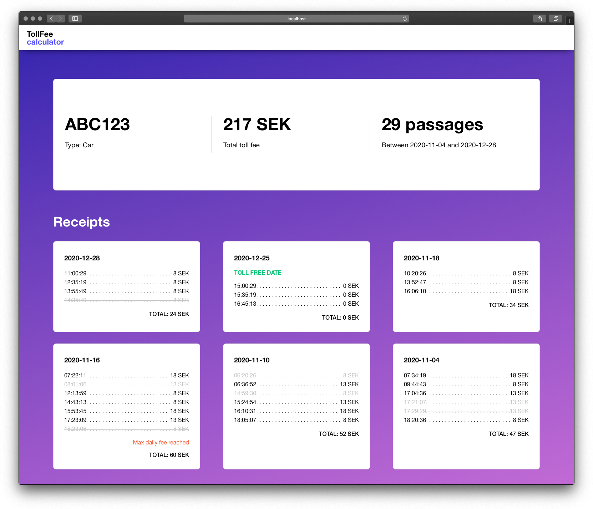

# Toll fee calculator

A simple react app for viewing your vehicle's toll fees.

- Total toll fee
- Number of toll station passages
- Toll fee receipts for dates with passages
- See which passages weren't charged, in case you drove a lot within the same hour



## Install

    $ git clone https://github.com/carolinekabat/toll-calculator.git
    $ cd toll-calculator/reactjs
    $ npm install

## Run app

    $ npm start

Open [http://localhost:3000](http://localhost:3000) to view app in the browser.

To view the app with initial data, add vehicle registration number [http://localhost:3000/?reg=abc123](http://localhost:3000/?reg=abc123) in the url to view toll fee calculations for vehicle ABC123.

Available test vehicles:

- ABC123 (car)
- EFG456 (truck)
- SOS112 (emergency)

To try with more vehicle types and data, just add a new vehicle `[RegNumber].json` file in `/public/mockDB`:

```
// Example EPA313.json

{
  "reg": "EPA313",
  "type": "tractor",
  "passages": {
    "2020-11-18": ["05:03:26", "12:06:10", "13:39:10"],
    "2020-11-17": ["08:23:16", "16:23:19"],
    "2020-11-16": ["07:23:06", "14:23:09"]
  }
}
```

## Run tests

    $ npm test

## Toll fee calculation details

For full specification, check out the [main assignment readme](../README.md).

### Fee price list

| Fee    | Time                                                                   |
| ------ | ---------------------------------------------------------------------- |
| 0 SEK  | 18:30 - 05:59 <br> Weekends <br> Holidays                              |
| 8 SEK  | 06:00 - 06:29 <br> 08:30 - 14:59 <br> 18:00 - 18:29                    |
| 13 SEK | 06:30 - 06:59 <br> 08:00 - 08:29 <br> 15:00 - 15:29 <br> 17:00 - 17:59 |
| 18 SEK | 07:00 - 07:59 <br> 15:30 - 16:59                                       |

- The maximum fee for one day is 60 SEK
- A vehicle should only be charged once an hour
  - In the case of multiple fees in the same hour period, the highest one applies.
- Some vehicle types are fee-free:
  - Motorbike
  - Tractor
  - Emergency
  - Diplomat
  - Foreign
  - Military

## Improvement ideas

- Check if API data is valid. Currently the calculator trust their "backend" to serve passages sorted by date and time with expected format and types.
- More proper routing/fecth data for route. For this small example app I didn't felt bringing in these packages was needed.
- UI
  - How to display long receipt info if a vehicle made a lot of passages? Collapse by hour?
  - Be able to view receipts and fees by month/year
  - Display other useful data, like average fee per day with charged passages
  - Toll free vehicles: what is useful data to display for them?
  - General design improvements
- Holiday support for any given year. This calculator is specialized on dates during year 2020.
